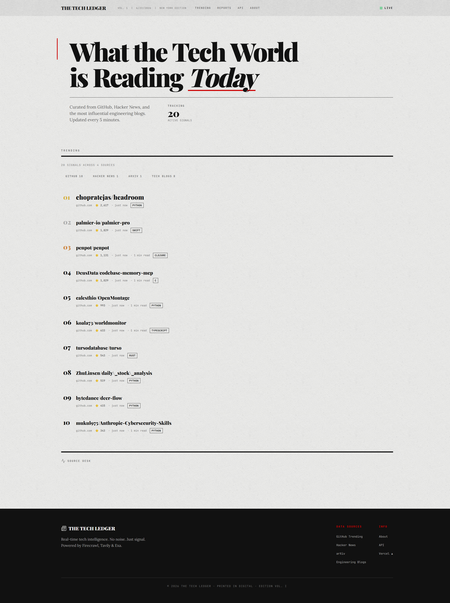
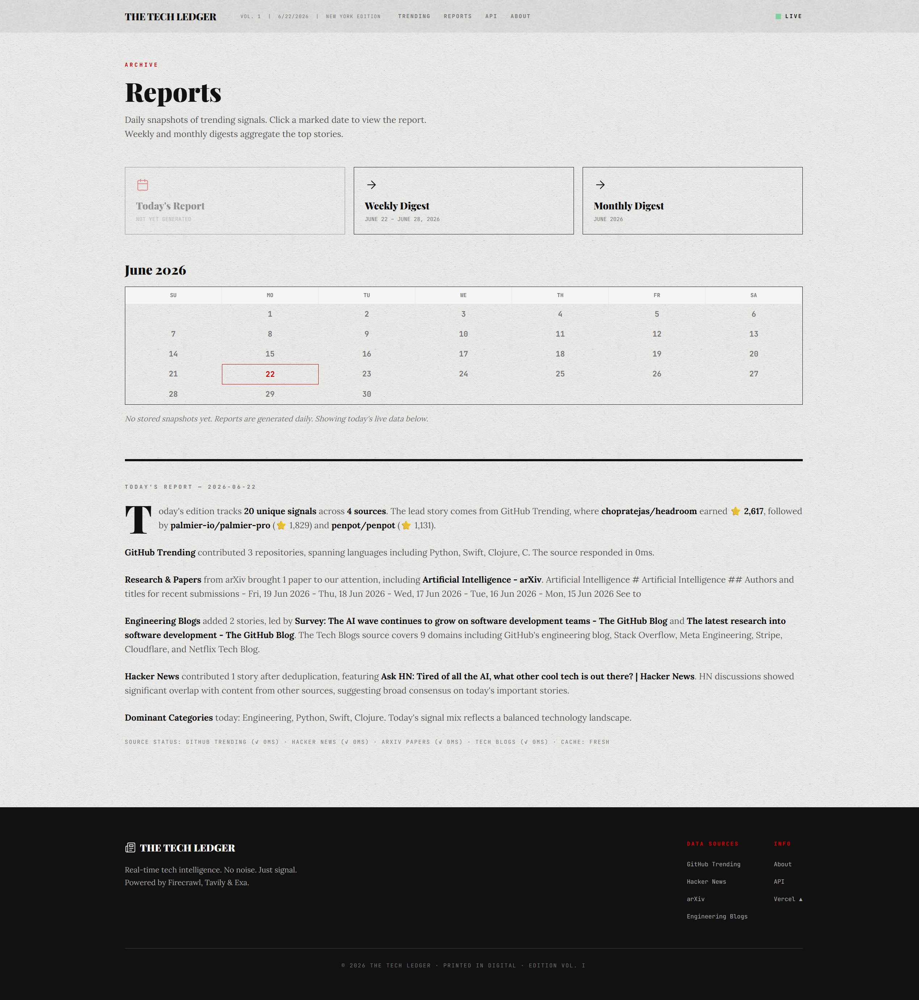
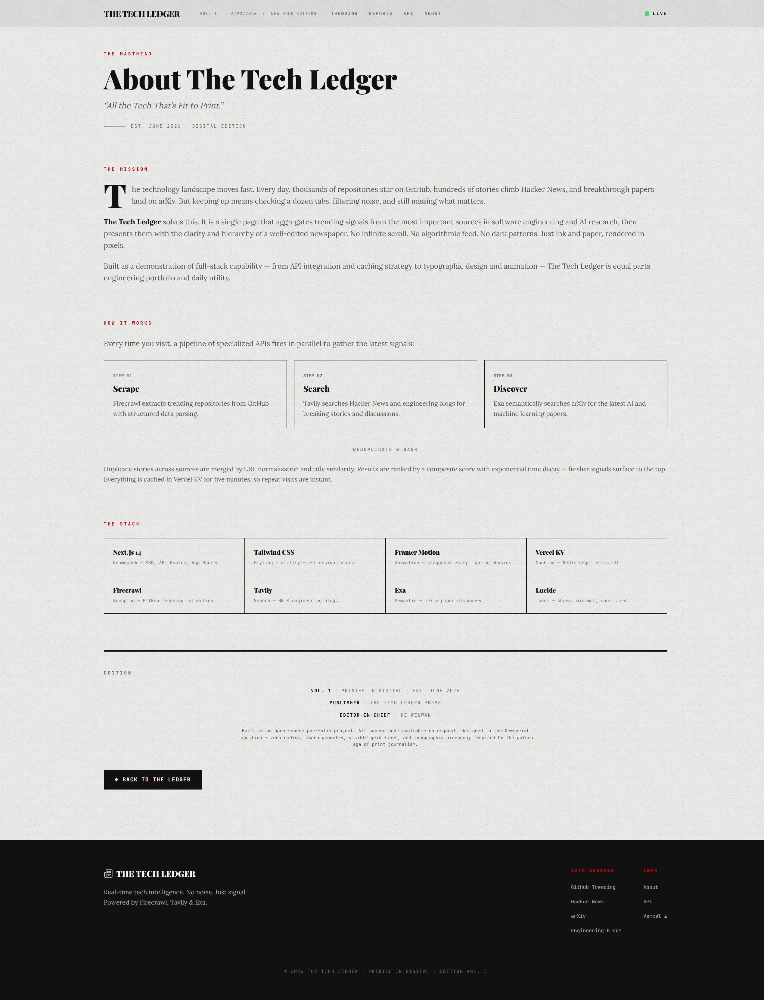

# The Tech Ledger（科技账本）

> 实时科技热点聚合器 · 新闻印刷编辑设计 · Vercel 部署

**「所有值得印刷的科技新闻。」** — 追踪软件工程和 AI 研究热点的数字报纸，以印刷品的权威感和清晰度呈现。

🔗 **在线地址:** [https://the-tech-ledger.vercel.app](https://the-tech-ledger.vercel.app)

---

## 功能特性

- **热点追踪** — 来自 GitHub、Hacker News、arXiv 和工程博客的实时信号，带分源时效衰减
- **来源筛选** — 标签页切换数据来源，金银铜奖牌排序
- **AI 编辑报告** — DeepSeek v4-flash 生成每日报纸风格编辑摘要；周报/月报通过摘要合成管道生成
- **报告档案** — 基于日历的导航，含日/周/月报告页面，Vercel Cron 每日快照
- **新闻印刷设计** — 零圆角，Playfair Display + Lora + Inter + JetBrains Mono 字体，Beige Paper 纹理，点状网格叠加，可见网格线，硬阴影悬停

---

## 技术栈

| 层 | 技术 |
|-------|-----------|
| 框架 | Next.js 14+ (App Router) |
| 语言 | TypeScript 5.x (strict) |
| 样式 | Tailwind CSS 3.4+, 自定义 CSS 工具类 |
| 动画 | Framer Motion 11+ |
| 缓存 | Vercel KV（每日 TTL） |
| 数据：抓取 | [Firecrawl](https://firecrawl.dev) |
| 数据：搜索 | [Tavily](https://tavily.com) |
| 数据：语义 | [Exa](https://exa.ai) |
| AI：摘要 | [DeepSeek v4-flash](https://api-docs.deepseek.com) |
| 图标 | [Lucide](https://lucide.dev) |

---

## 快速开始

```bash
npm install
cp .env.example .env.local
# 在 .env.local 中填入 API keys
npm run dev
```

### 所需 API Keys

| Key | 服务 | 获取地址 |
|-----|---------|-----------|
| `FIRECRAWL_API_KEY` | 网页抓取 | [firecrawl.dev](https://firecrawl.dev) |
| `TAVILY_API_KEY` | AI 搜索 | [tavily.com](https://tavily.com) |
| `EXA_API_KEY` | 语义搜索 | [exa.ai](https://exa.ai) |
| `DEEPSEEK_API_KEY` | AI 摘要 | [platform.deepseek.com](https://platform.deepseek.com) |
| `REFRESH_TOKEN` | 缓存刷新 | 任意随机字符串 |

没有 API key 时，网站正常渲染但显示零信号。

---

## CI/CD

每次推送到 `main` 自动运行：

- **TypeCheck + Lint + Build** — `tsc --noEmit` → `next lint` → `npm run build`
- **安全审计** — `npm audit`
- **密钥扫描** — Gitleaks 检测硬编码密钥
- **Vercel 自动部署** — 构建通过后自动上线

---

## 设计系统

The Tech Ledger 遵循严格的 **Newsprint** 设计语言：

- **零圆角** — 每个元素都是锋利边缘
- **无软阴影** — 悬停使用硬偏移 `box-shadow: 4px 4px 0 #111`
- **无暗色模式** — 仅浅色（`#F9F9F7` 背景）
- **可见网格** — 边框被强调，而非隐藏
- **字体层级** — Playfair Display（标题），Lora（正文），Inter（UI），JetBrains Mono（数据）

详见 [CLAUDE.md](CLAUDE.md)。

---

## 截图

| 首页 Trending | Reports 报告 | About 关于 |
|:---:|:---:|:---:|
|  |  |  |

---

## 许可证

Apache License 2.0 — 参见 [LICENSE](LICENSE)。
